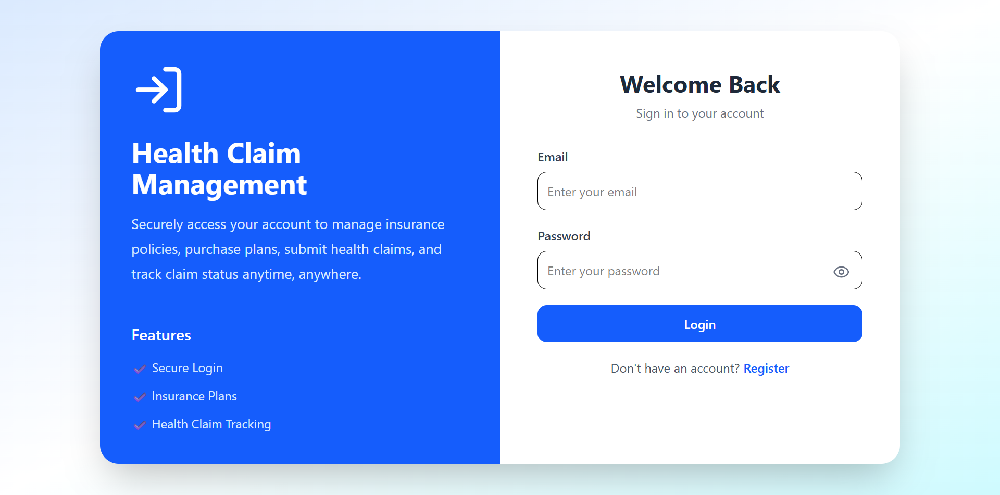
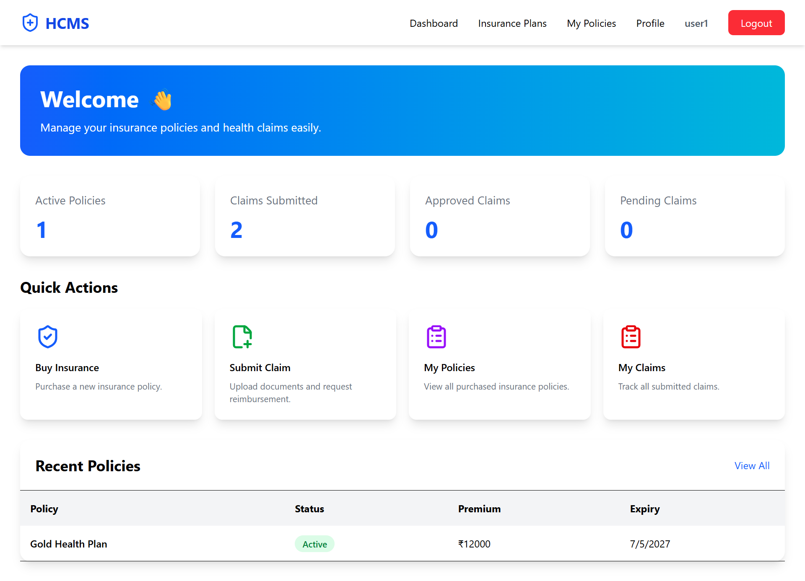
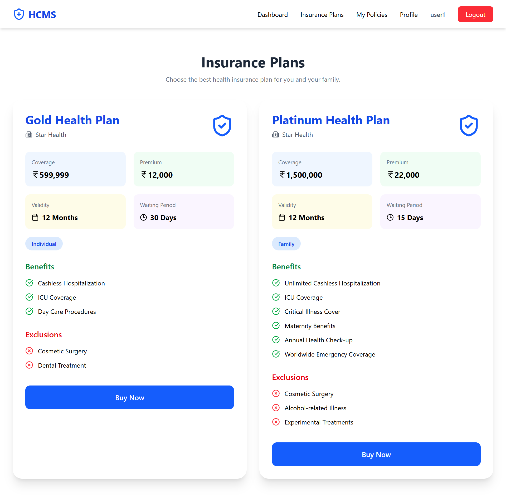
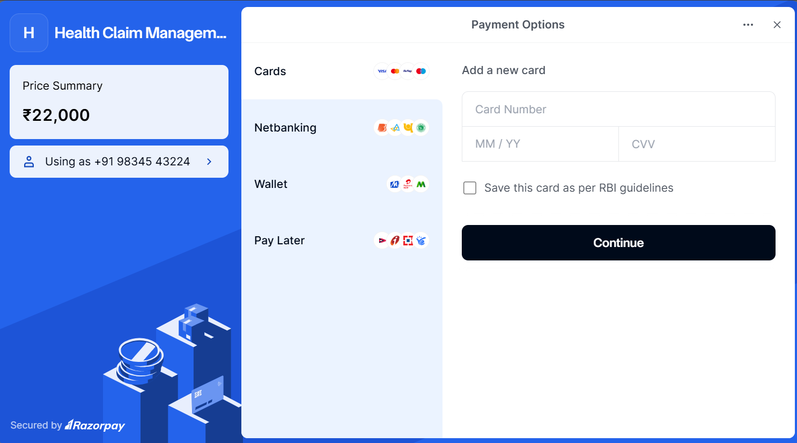
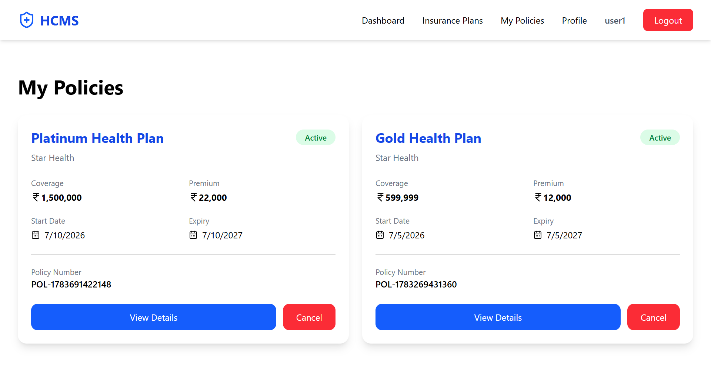
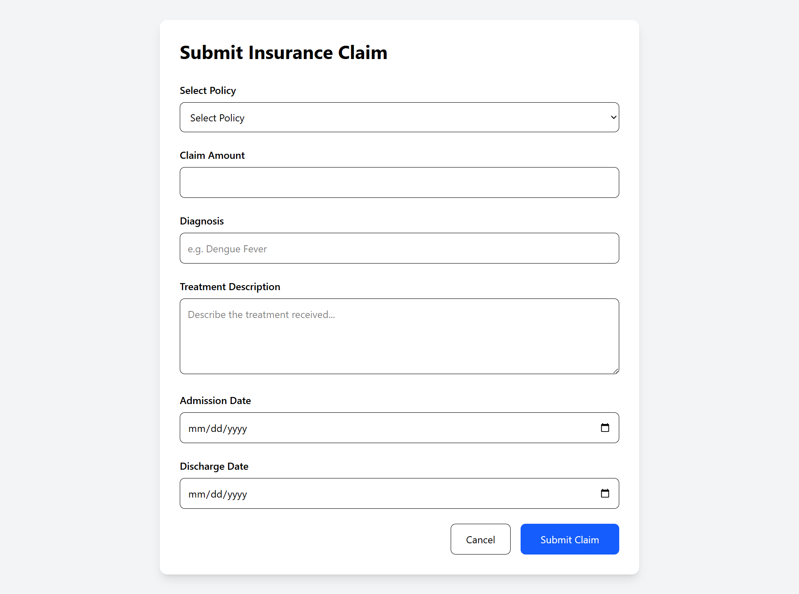
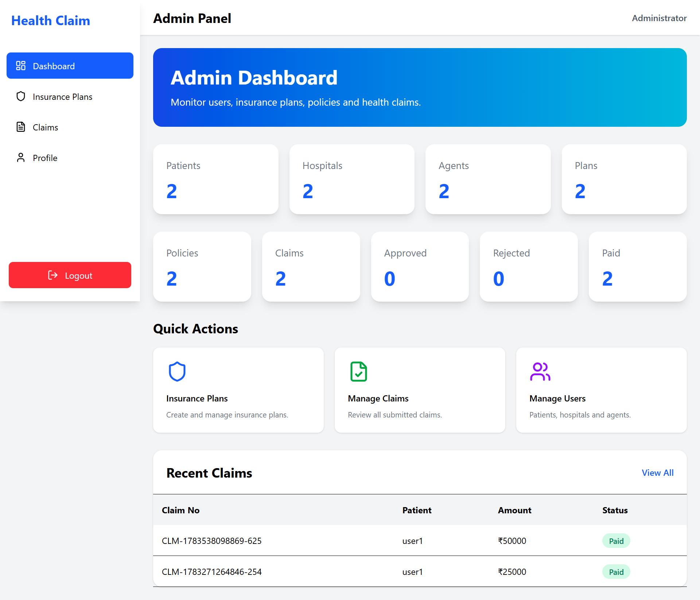
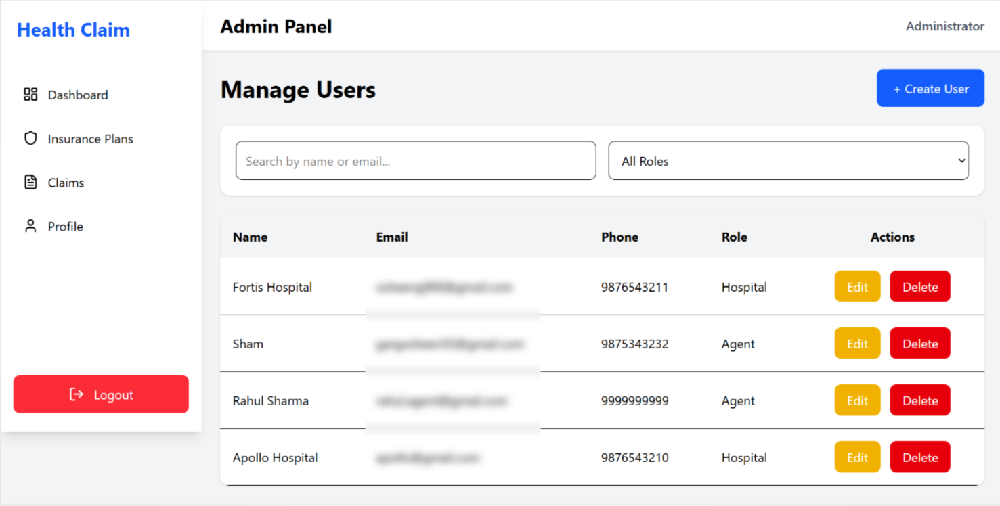
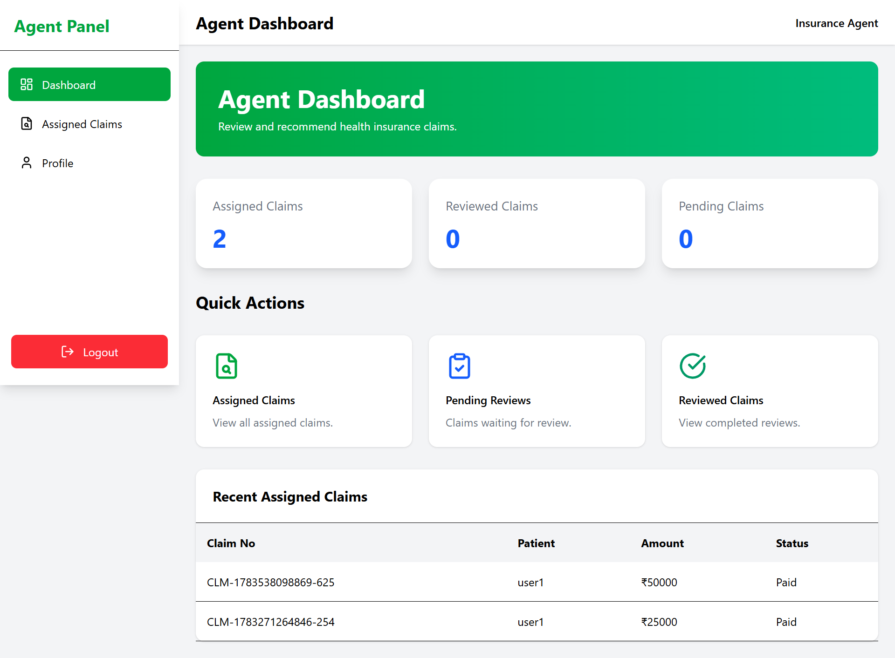

# 🏥 Health Claim Management System (HCMS)

A full-stack **MERN (MongoDB, Express.js, React.js, Node.js)** application that streamlines the health insurance claim process through a secure, role-based workflow. The system enables patients to purchase insurance policies, submit claims, and track their status while allowing hospitals, insurance agents, and administrators to perform their respective responsibilities.

---

## Features

###  Patient

* Register and Login (JWT Authentication)
* Browse available insurance plans
* Purchase insurance policy using Razorpay
* Submit health insurance claims
* Track claim status in real time
* View policy and claim history

###  Admin

* Dashboard with claim statistics
* Create, update, and delete insurance plans
* Create Hospital and Agent accounts
* Send login credentials via Nodemailer
* Assign hospitals to verify claims
* Assign agents for claim review
* Approve or reject claims
* Mark approved claims as paid
* Manage users and claims

### Hospital

* Dashboard with assigned claims
* View assigned claim details
* Verify treatment information
* Add verification remarks
* Update claim verification status

###  Insurance Agent

* Dashboard with assigned claims
* Review verified claims
* Add recommendations and remarks
* Forward reviewed claims for admin approval

---

#  Tech Stack

## Frontend

* React.js
* React Router DOM
* Tailwind CSS
* Axios
* React Toastify
* Lucide React Icons

## Backend

* Node.js
* Express.js
* MongoDB
* Mongoose
* JWT Authentication
* bcrypt
* Nodemailer
* Razorpay

## Database

* MongoDB Atlas

---

#  Authentication & Security

* JWT-based Authentication
* Role-Based Authorization
* Password Encryption using bcrypt
* Protected API Routes
* Secure Login System

---

# 📂 Project Structure

```
HealthClaimManagementSystem
│
├── Frontend
│   ├── src
│   ├── public
│   └── package.json
│
├── Backend
│   ├── src
│   │   ├── controllers
│   │   ├── models
│   │   ├── routes
│   │   ├── middleware
│   │   ├── services
│   │   ├── config
│   │   └── utils
│   ├── package.json
│   └── server.js
│
├── .env.example
├── .gitignore
└── README.md
```

---

# 🔄 Project Workflow

```
Patient
   │
   ▼
Register / Login
   │
   ▼
Purchase Insurance Policy
   │
   ▼
Submit Claim
   │
   ▼
Admin Assigns Hospital
   │
   ▼
Hospital Verifies Treatment
   │
   ▼
Admin Assigns Agent
   │
   ▼
Agent Reviews Claim
   │
   ▼
Admin Approves / Rejects
   │
   ▼
Payment Settlement
```


## Backend

```bash
cd Backend
nodemon server.js
```

---

## Frontend

```bash
cd Frontend
npm install
npm run dev
```

---

# 🔑 Environment Variables

Create a `.env` file inside the Backend folder.

```env
PORT=5000

MONGO_URI=your_mongodb_connection_string

JWT_SECRET=your_jwt_secret
JWT_EXPIRE=
ADMIN_NAME=
ADMIN_EMAIL=
ADMIN_PASSWORD=

RAZORPAY_KEY_ID=your_key_id

RAZORPAY_KEY_SECRET=your_key_secret

EMAIL_USER=your_email@gmail.com

EMAIL_PASS=your_gmail_app_password
```

---

## Screenshots

### Login Page


### Patient Dashboard


### Insurance Plans


### Payment Page


### My Policies


### Submit Claim


### Admin Dashboard


### Create User


### Hospital Dashboard


### Agent Dashboard


---

#  Learning Outcomes

Through this project, I gained practical experience with:

* MERN Stack Development
* REST API Development
* MongoDB Database Design
* JWT Authentication
* Role-Based Access Control
* Payment Gateway Integration (Razorpay)
* Email Integration (Nodemailer)
* Secure Password Hashing
* CRUD Operations
* Frontend and Backend Integration

---

# 🔮 Future Enhancements

* Document Upload using Multer and Cloudinary
* OTP-based Forgot Password
* SMS and Email Notifications
* Admin Analytics Dashboard
* AI-based Fraud Detection
* PDF Report Generation
* Claim History Export
* Multi-Factor Authentication

---

#  Author

**Osheen Garg**

MCA Student | MERN Stack Developer

GitHub: https://github.com/Osheen-garg

LinkedIn:  www.linkedin.com/in/osheen-garg-698aa2250
---

## ⭐ If you found this project useful, consider giving it a star on GitHub!
